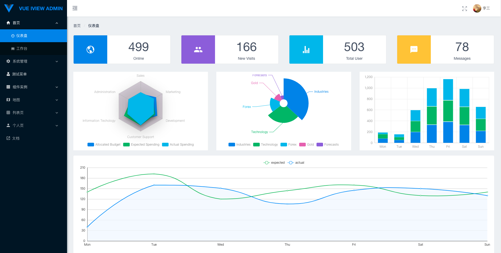
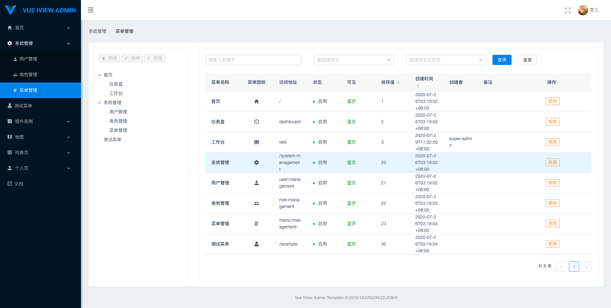
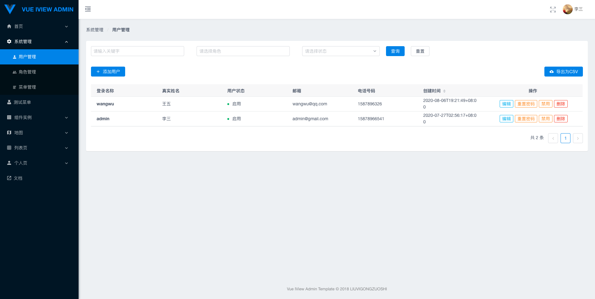
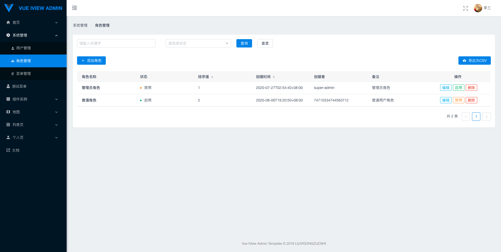
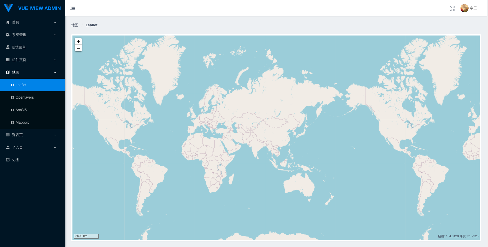
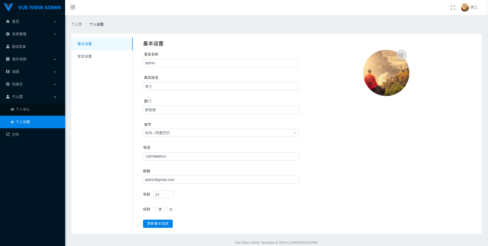

<p align="center">
  <a href="https://github.com/liuvigongzuoshi/vue-iview-admin-template">
    
  </a>
</p>

<div align="center">

# vue-iview-admin-template

基于 View UI 组件库参考 Ant Design Pro 的 vue 2.0 后台管理系统模板

[](https://github.com/vuejs/vue)
[](https://github.com/view-design/ViewUI)
[](https://www.travis-ci.org/liuvigongzuoshi/vue-iview-admin-template)
[](https://opensource.org/licenses/MIT)
[](https://app.netlify.com/sites/vue-iview-admin-temp/deploys)

</div>

**Live demo one:** [https://vue-iview-admin-template.ywbang.icu](https://vue-iview-admin-template.ywbang.icu)

**Live demo two:** [https://vue-iview-admin-temp.ywbang.icu](https://vue-iview-admin-temp.ywbang.icu) 

## Usage

```bash
# Clone project
git clone https://github.com/liuvigongzuoshi/vue-iview-admin-template.git

# Install dependencies
npm install

# Compiles and hot-reloads for development
npm run dev

# Compiles and minifies for production
npm run build

# Compiles and minifies for production and analysis report
npm run build:r

# Lints and fixes files
npm run lint
```

## Screenshot

|                                        |                                        |                                        |
| -------------------------------------- | -------------------------------------- | -------------------------------------- |
|  |  |  |
|  |  |  |

## Related projects
- [vue-cli-plugin-viewui-admin](https://github.com/liuvigongzuoshi/vue-cli-plugin-viewui-admin) - ViewUI(iView) admin template plugin for @vue/cli 4
- [gin-admin-template](https://github.com/liuvigongzuoshi/gin-admin-template) - BackEnd Admin Template

## Links

- [Live demo one](https://vue-iview-admin-template.ywbang.icu)
- [Live demo two](https://vue-iview-admin-temp.ywbang.icu)
- [Documentation](https://liuvigongzuoshi.github.io/vue-iview-admin-template/)

## Browsers support

| [](http://godban.github.io/browsers-support-badges/)</br>IE / Edge | [](http://godban.github.io/browsers-support-badges/)</br>Firefox | [](http://godban.github.io/browsers-support-badges/)</br>Chrome | [](http://godban.github.io/browsers-support-badges/)</br>Safari | [](http://godban.github.io/browsers-support-badges/)</br>Opera |
| --------------------------------------------------------------------------------------------------------------------------------------------------------------------------------------------------------------- | ----------------------------------------------------------------------------------------------------------------------------------------------------------------------------------------------------------------- | ------------------------------------------------------------------------------------------------------------------------------------------------------------------------------------------------------------- | ------------------------------------------------------------------------------------------------------------------------------------------------------------------------------------------------------------- | --------------------------------------------------------------------------------------------------------------------------------------------------------------------------------------------------------- |
| IE11, Edge                                                                                                                                                                                                      | last 2 versions                                                                                                                                                                                                   | last 2 versions                                                                                                                                                                                               | last 2 versions                                                                                                                                                                                               | last 2 versions                                                                                                                                                                                           |

## License

[MIT](https://github.com/liuvigongzuoshi/vue-iview-admin-template/blob/master/LICENSE)

Copyright (c) 2018 liuvigongzuoshi
